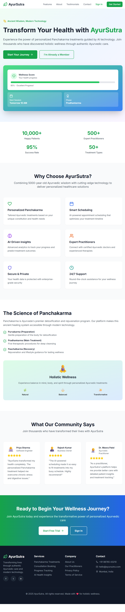
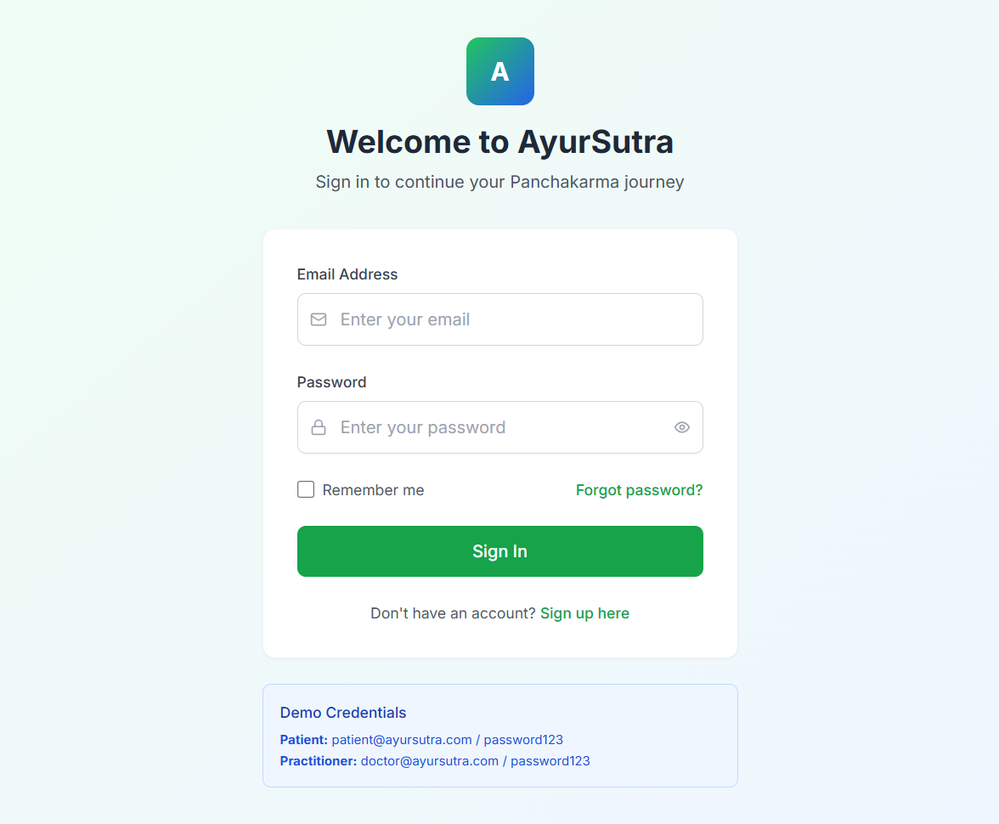
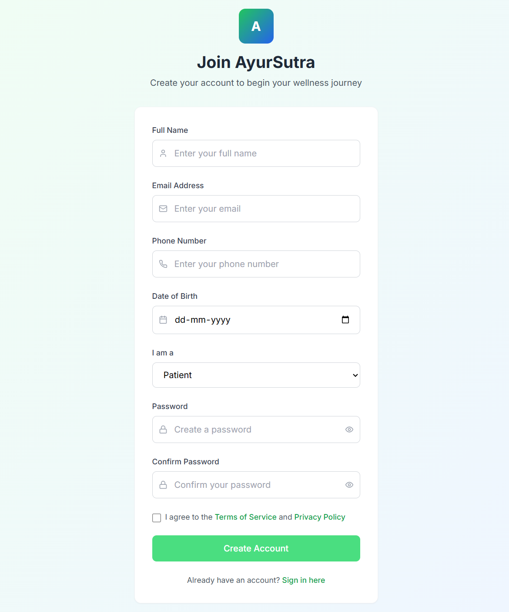
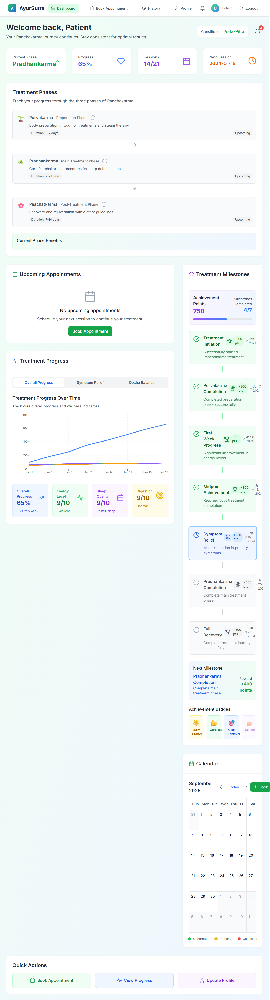
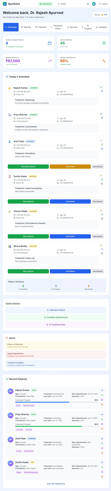
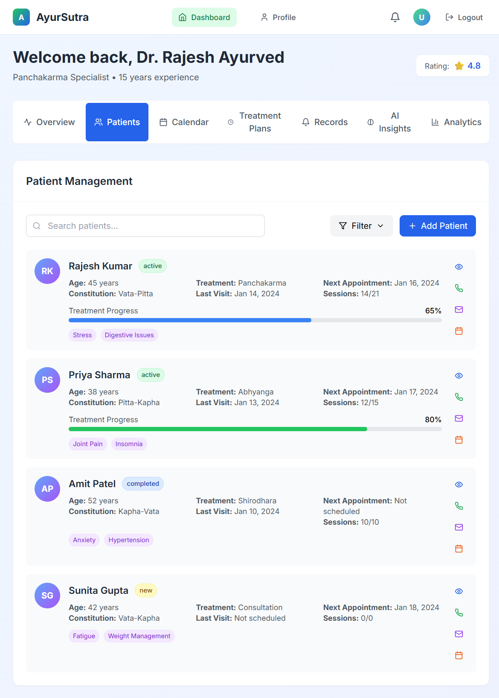
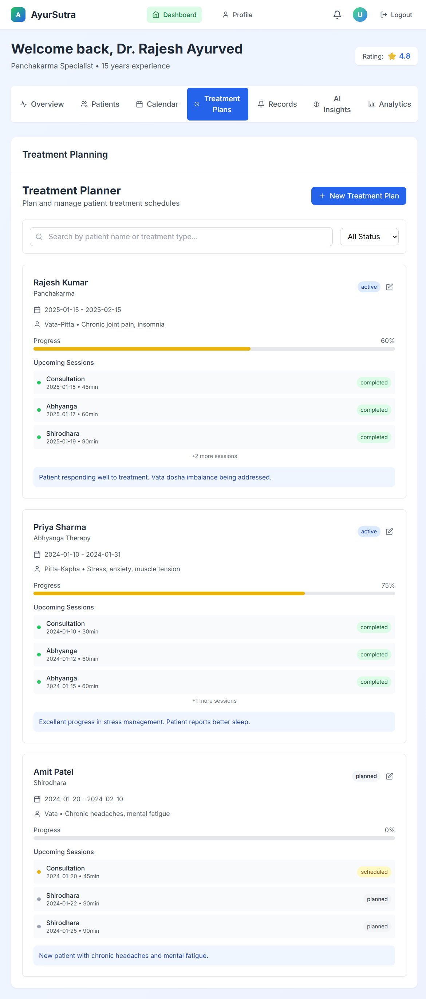
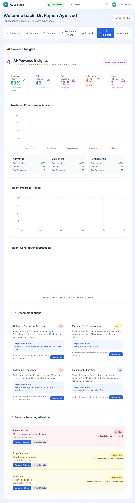
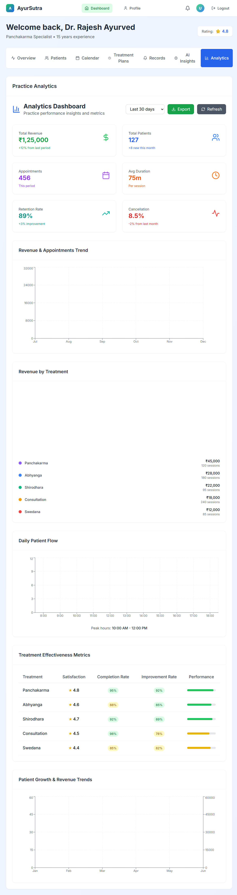

# AyurSutra - Panchakarma Management System

A comprehensive Ayurvedic healthcare management platform with AI-powered scheduling and patient tracking.


## 🏆 SIH 2025 Context

- Built for Smart India Hackathon 2025
- Problem Statement ID: 25023
- Problem Statement Title : AyurSutra- Panchakarma Patient Management and therapy scheduling Software

## 🌟 Features

- **Patient Dashboard** - Progress tracking, appointment booking, treatment history
- **Practitioner Interface** - Patient management, AI insights, treatment planning
- **AI Scheduling** - Intelligent appointment optimization (coming soon)
- **Role-based Authentication** - Secure JWT-based access control
- **Responsive Design** - Modern UI with Tailwind CSS
- **Real-time Analytics** - Treatment effectiveness and progress metrics(coming soon)


## 🖼️ Screenshots (Demo)

Note: These are prototype UI screens.












## 🛠️ Technology Stack

- **Frontend**: React.js, Tailwind CSS, React Router, Recharts
- **Backend**: Node.js, Express.js, JWT Authentication
- **Database**: PostgreSQL (production), Mock data (development)
- **Deployment**: Vercel(soon)
- **Future**: AI Service (Python), Kubernetes scaling(soon)

## ⚡ Quick Start

### Prerequisites
- Node.js 16+ and npm 8+
- Git

### Local Development

1. **Clone Repository**
```bash
git clone https://github.com/SomyaST2005/ayursutra-panchakarma-system.git
cd ayursutra-panchakarma-system
```

2. **Install Dependencies**
```bash
npm run install-deps
```

3. **Start Development Servers**
```bash
npm run dev
```

- Frontend: http://localhost:3000
- Backend: http://localhost:5000


## 🎯 Demo Credentials

**Patient Account:**
- Email: `patient@ayursutra.com`
- Password: `password123`

**Practitioner Account:**
- Email: `doctor@ayursutra.com`
- Password: `password123`

## 📊 Key Components

### Patient Features
- **Dashboard**: Treatment progress, upcoming appointments
- **Booking**: AI-optimized appointment scheduling
- **History**: Complete treatment records and feedback
- **Progress**: Visual analytics and milestone tracking

### Practitioner Features
- **Patient Management**: Comprehensive patient records
- **Treatment Planning**: Session scheduling and progress monitoring
- **AI Insights**: Treatment effectiveness analytics
- **Calendar**: Appointment management and availability

## 🔮 Roadmap

- [ ] **Phase 1**: Core functionality (✅ Complete)
- [ ] **Phase 2**: PostgreSQL integration
- [ ] **Phase 3**: AI scheduling algorithms
- [ ] **Phase 4**: Mobile app development
- [ ] **Phase 5**: Multi-center management


## 📄 License

This project is licensed under Our Group - NavAyush for SIH 2025


## 🙏 Acknowledgments

- Built for holistic wellness and Ayurvedic healthcare
- Inspired by traditional Panchakarma practices
- Modern technology meets ancient wisdom

---

**Made with ❤️ for holistic wellness By NavAyush Team** | **© 2025 AyurSutra**